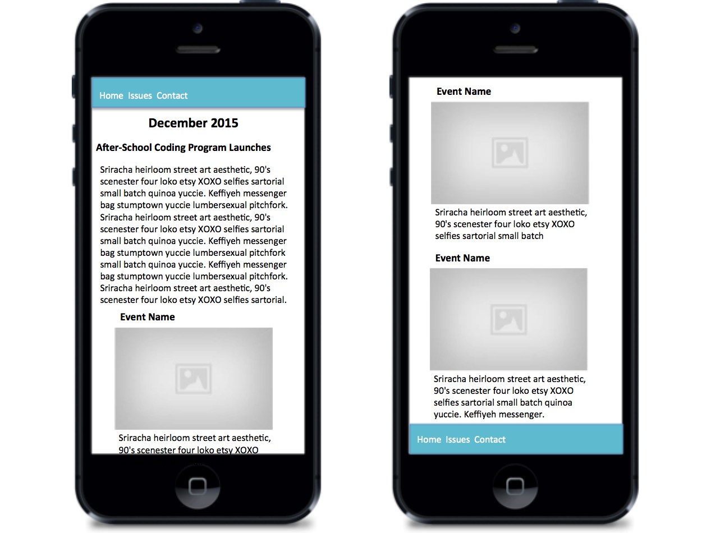
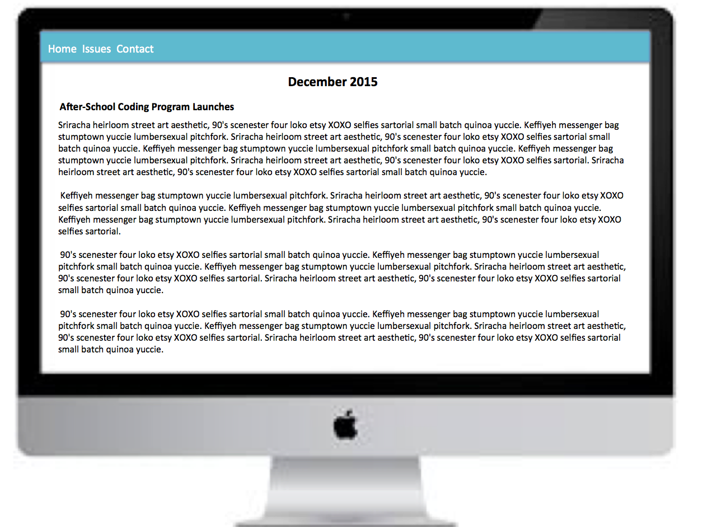
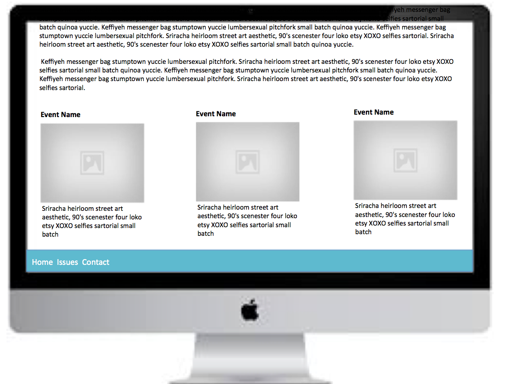

### Mobile First Design

We're going to be creating a super simple webpage with the basic html and CSS that we've already learned. To do this we're going to actually practice a little bit of mobile first design. We've got two mockups which we're going to base our design from.

Here you can see the mobile site:



This is where we'll start. Notice that when you start small, there's a lot less space you need to fill which makes your life easier. Only the core elements need to be displayed *and* there are a lot less options for display. Things *have* to be kept clean and simple.

Once we've created the mobile design we'll use media queries to adapt the display slightly for larger devices.

Here you can see the simple changes for a desktop view:




Let's get started!

Create a folder in your projects directory to store your HTML and CSS files in.  

Touch `index.html`, `mystyle.CSS` and `normalize.CSS` and open in atom.  

In `index.html` in atom type `html<tab>` and it should auto fill the Doctype information at the top.    

Include the meta information for the viewport just below the existing '<meta charset="utf-8">' tag.
<meta name="viewport" content="width=device-width, initial-scale=1">
Give the webpage a title: *Newsletter*  

Place the links to your two stylesheets in the head section of your html.  

```html
<link type="text/CSS" rel="stylesheet" href="normalize.CSS">
<link type="text/CSS" rel="stylesheet" href="mystyle.CSS">
```

Remember that the stylesheets are read from top to bottom so we want the `normalize.CSS` file to be read first. This ensures that it is resetting our webpage to display the same across all browsers.  Then our additional styling will be read from the `mystyle.CSS` file.  

Now, were ready to get started laying out the structure of our html page.      

Looking back at our mockup we can see that we need a header and footer so we can go ahead and create those elements:  

```html
<header>
</header>

<footer>
</footer>
```
I need a title on my page so I'll go ahead and create one between the header and footer elements. I'm placing it inside a div knowing that I'll want to easily move it around the page later.

```html
<div class="month_title">
<h1>December 2015</h1>
</div>
```

I'll also need content to go in the main body of the newsletter so I'll include that below the title using a `<article></article>` tag. An article tag is a separator like a div but it gives more detail and semantically its more correct since we are actually using it to enclose an article.

```html
<article class="main-article">
</article>
```

I want a space for events as well so those will go inside another section.  

```html
<section class="events">
</section>
```
My entire body section now looks like this:  

```html
  <body>
    <header>
    </header>

    <div class="month_title">
    <h1>December 2015</h1>
    <div>

    <article class="main-article">
    </article>

    <section class="events">
    </section>

    <footer>
    </footer>

  </body>
  ```

Remember that it is important to start adding class names while your creating your html structure. This allows you to differentiate tags from each other, like our two section elements on the page. It also prepares you for the styles you'll add later with CSS.  

Now lets progress down the page from top to bottom.  

We start with our header. This will contain the main navigation links for the site.  

Place the following code inside the header tags.  

```html
      <nav>
        <ul>
          <li><a href="#">Home</a></li>
          <li><a href="#">Issues</a></li>
          <li><a href="#">Contact</a></li>
        </ul>
      </nav>
```

`<nav></nav>` tags are used to define sections that will contain main navigation links for a site.  

Links are typically stored in unordered lists. The `<ul></ul>` tags delineate the start end of a list and the `<li></li>` tags show the beginning and end of each item in that list.  

Links themselves begin and end with `<a></a>` tags and are *nested inside* the `<li></li>` tags. Remember, nested tags must be closed in order!  

Finally notice the `<a href="#">` portion of the link. This is called a stub and is used as a placeholder when you have not yet specified where the page should link to.   

We have a title set up for the main page, "December 2015" but we're also going to need an article title for the main article of our site.
```html
  <section class="main-article">
      <h3>After-School Coding Program Launches</h3>
  </section>
```

We also need some content so lets add some `<p></p>` tags.  

```html
 <section class="main-article">
      <h3>WAfter-School Coding Program Launches</h3>
      <p></p>
      <p></p>
      <p></p>
      <p></p>
      <p></p>
  </section>

```

*On Your Own...*
Grab some filler [text](www.hipsum.co) here or from wherever you like and place it in the paragraph tags.  
*-----------------------------------------------*
The next section contains events and for each event we want to have an event title, and then an image with some text below it.  

In order for these elements to display below other it would make sense that they are "attached". To do this we can place in the same container div.  

```html
    <div class="each_event">
        <h5>Event 1</h5>
        
        <p>Echo park kogi thundercats, vice vinyl sustainable 3 wolf moon plaid cornhole marfa 90's helvetica migas humblebrag. Next level wolf umami.</p>
    </div>
```

Here we are creating a div which holds a header, image and paragraph inside it.  

You can use an image on your computer, from the internet or a [placeholder](https://placehold.it/).  

*On Your Own...*
Make two more divs, both with the same `.each-event` class and place an image and a short paragraph inside each of them.  
*-----------------------------------------------*

That's enough in our body for now so let's go ahead and finish out our layout with the footer.  

Our footer is going to contain the same navigation links as our header and some social media links.  

First, put the same information from the  `<nav></nav>` links in the header into the footer section.  

Now we'll add some social media icons not pictured in the mockup. We'll grab these from [Font Awesome](https://fortawesome.github.io/Font-Awesome/). This site contains over 600 free icons which act just like fonts so you can change their color or size using the same CSS you would use to change text.  

In the getting started section of the site follow the steps in the *EASIEST: BootstrapCDN by MaxCDN* section. Place the link in the <head></head> section of your html.

Now lets add the Twitter icon and link it to Twitter. Add the code below right under your "Contact" link.  

```html
    <li><a href="https://twitter.com"><i class="fa fa-twitter"></i></a></li>
```

Notice that because the icon is what we want to display for the link, it is nested *inside* of the anchor tag.  

*On Your Own...*

Add two more icons linking to Facebook and Instagram.  
*-----------------------------------------------*
***********************************************************************************
###CSS

From the link [here](https://necolas.github.io/normalize.CSS/) download the normalize file and copy its contents into the normalize.CSS stylesheet we created earlier.  

Open the `mystyle.CSS` document and lets get started.  

First, its important to be organized so we want to create sections that correspond with each section of our html that we'll be styling.  

We have the following sections:
* header
* title div
* main article section
* events section
* footer

These are enough to start with. You can add more sections later if you wish. Its important to start with some type of organizational structure in the beginning and you can always modify this later as you begin develop your own sense of organization.  

Place the following code in `mystyle.CSS`.  

```css
/*----------------------------------------*/
/*-----------------HEADER-----------------*/
/*----------------------------------------*/

/*----------------------------------------*/
/*---------------TITLE DIV----------------*/
/*----------------------------------------*/

/*----------------------------------------*/
/*--------MAIN ARTICLE SECTION-----------*/
/*----------------------------------------*/

/*----------------------------------------*/
/*-------------EVENTS SECTION-------------*/
/*----------------------------------------*/

/*----------------------------------------*/
/*-----------------FOOTER-----------------*/
/*----------------------------------------*/
```
These comments will help you stay organized as you begin to manipulate different elements on the page.  

With that done there are couple of other things we should do at the beginning of any project. These are some default values that are often a good idea but not mandatory. As you continue to create projects you'll develop a feel for what things you'll typically want to use.  

Place the code below at the top of your stylesheet above the comments.  

```css  
html {
  box-sizing: border-box;
}

li {
  list-style-type: none;
}

a {
  text-decoration: none;
}
```

 The `html` selector sets all items in your html to default to border-box sizing. This means that content, margin and padding are all included inside an element's size automatically.  See lecture notes and/or [W3CSchools](http://www.w3schools.com/CSS/CSS3_box-sizing.asp) for more information.  

The `li` selector sets all of your list items to *not* have bullet points. Typically when designing you rarely use lists as actual bullet point lists so this sets the default behavior to exist without the bullets. This is set at the top so you can override it later on in the page if you find yourself needing a "typical" list.  

The `a` selector sets all links to not be underlined. (Soooooo 90's!!!)  

Now that we have those basics out of the way...  

Let's start by styling the header.  

```css
/*----------------------------------------*/
/*-----------------HEADER-----------------*/
/*----------------------------------------*/

header {
  background-color: teal;
}

a, a:visited {
  color:white;
}

a:hover {
  color:lightgrey;
}

ul {
  margin:0;
  padding:0;
  display: flex;
}
```
It's pretty common to give links a different color when they are hovered over. You also want to remember to set the clicked color or it may default to something you weren't planning on.

Many elements like `ul`'s have default settings for margin and padding. Here we are setting those to 0 as a base that we can then work from to create our own settings.  

Setting the display to flex makes the `ul` a container. It's items will default to being set at `flex-direction:row;` (or horizontal). In this case we want our links to be displayed horizontally so that works great and we don't have to do anything more.  

Let's set some space between our list elements by placing this CSS below the `<ul></ul>`:  

```css
li {
  padding: 10px;
}
```

The title of the page "December 2015" should be centered.  The title is an `h1` inside of a `div`. To move it to the middle we just need to make the outer div a container with `display: flex;` and then center the item(the heading) inside of it.

```css
/*----------------------------------------*/
/*---------------TITLE DIV----------------*/
/*----------------------------------------*/

.month_title {
  display:flex;
  justify-content: center;
}
```

There's some extra whitespace we don't need below the `<h1></h1>` so we can remove that.

```css
.month_title h1 {
  margin-bottom: 0;
}
```
That works. Now we need to style the main article a little bit. The main article is right up against the edge of the page so adding padding will format that properly.  

```css
/*----------------------------------------*/
/*--------MAIN ARTICLE SECTION-----------*/
/*----------------------------------------*/
.main-article {
  padding: 0 20px 0 2px;
}
```

In the events section we want each event to be displayed stacked on top of each other on a mobile device. The event title should be on top, the text should fit neatly below the images they are referencing and the images should fill the whole width of the screen.  


To do this we'll first set up our parent container. The section with the class of `.events` will contain all of the smaller event elements inside of it. We need to get started by setting it to `display: flex;`.

```css
/*----------------------------------------*/
/*-------------EVENTS SECTION-------------*/
/*----------------------------------------*/
.events {
  display:flex;
  flex-direction: column;
}
```
We want each of the smaller events to line up below each other inside of this rectangle. The default direction is row so we will set it to column instead for mobile.

We will also set `.each-event` to be a container and set the elements inside it to be stacked in a column instead of the default row direction. This can later be switched back to row with a media query when we are redesigning for desktop.

```css
.each_event {
  display: flex;
  flex-direction: column;
  padding: 20px;
}
```

Finally we can stretch the images to take up the entire width of the screen.

```css

.each_event img {
  width:100%;
  height: auto;
}
```

Ok, this looks great! On an iPhone 4 anyway.

Now there are a myriad of sizes between an iPhone 4 and a desktop but for the sake of this lesson we're only going to look at adapting our mobile design for a desktop...

Let's place our media query at the bottom of all the current CSS we've written. Remember, we do this so that we inherit all the CSS we've written and only override the things we need to change. Here we're setting the media query to take effect on screen _(as opposed to a print or other layout)_ and when the device is at least 1200px wide.

```css
@media only screen and (min-width : 1200px) {

}
```

It may help to organize your media query according to the same layout used in the body of the main design of your site. This will ensure that you look at each section and adapt it accordingly. We won't be changing much here but good habits are important.

```css
@media only screen and (min-width : 1200px) {
  /*-----------------HEADER-----------------*/

  /*---------------TITLE DIV----------------*/

  /*--------MAIN ARTICLE SECTION-----------*/

  /*-------------EVENTS SECTION-------------*/

  /*-----------------FOOTER-----------------*/

}
```

With this setup I can scan each section. I can quickly see that I don't really need any changes in the first three sections or the footer so I'll quickly throw comments in to remind me that I've looked at these and decided they don't need any work.

```css
  /*-----------------HEADER-----------------*/
  /* no changes */
  /*---------------TITLE DIV----------------*/
  /* no changes */
  /*--------MAIN ARTICLE SECTION-----------*/
  /* no changes */
  /*-------------EVENTS SECTION-------------*/

  /*-----------------FOOTER-----------------*/
  /* no changes */
```

Now I can focus on a section where I do need a change, the events section. These events look massive and weird stacked on top of each other. They are intended to be small sections so I want to display them next to each other.

The section with the class of `.events` should be a rectangle container as we discussed earlier and each of the events should line up inside of it. For mobile they were stacked but on a desktop they should line up next to each other.

I'll modify the `.events` class to have a flex direction of row. I'll check my design and... wow that was really easy!

If I resize the screen a little I can see that any smaller than 1200px and it reverts back to the events being stacked. Pretty cool but looks weird. Lets go ahead and design for a few smaller devices. Without going super in depth let's just say that on an iPad sized device I want the images in rows but for anything smaller stacking is cool.

Using the dev tools, I can see that an iPad is 768px wide in portrait mode so I'll go ahead and modify the media query to be for devices _at least_ that width.

```css
@media only screen and (min-width : 768px) {
/* OUR CSS IS STILL HERE */
}
```
And just like that...

We have a simple responsive site built with HTML and CSS that looks great on mobile and desktop. No templates or frameworks, just good ol' fashioned design principles.

With this simple foundation you're now prepared to go on and build more complicated structures from scratch or add in frameworks as needed. Happy coding!!!
